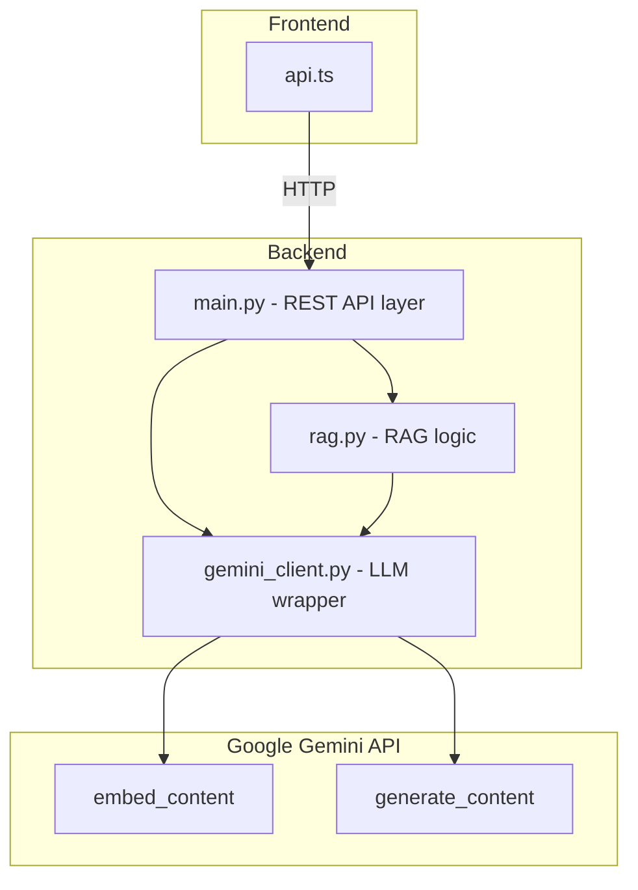

# Tech Career Fit Engine - LLM API Usage Manual

This document describes how the product structures and invokes LLM APIs in the engineering implementation, as well as how the backend REST API wraps these calls.

---

## 1. Product Overview

**Tech Career Fit Engine** is an AI-powered resume and job matching analysis tool. Its main features include:

- **Resume parsing and structuring**: Parse PDF/DOCX/TXT resumes and extract experience, skills, and education
- **Experience clustering**: Cluster resume content into tech roles such as MLE/DS/SWE/QR/QD
- **Job matching analysis**: Analyze resume–JD fit, requirements, and gaps based on RAG retrieval
- **Cluster-based matching**: Show match percentages and evidence by role cluster against the JD
- **Resume generation**: Generate tailored resumes for target roles (strictly evidence-based, no fabrication)

The product uses **Google Gemini API** for these AI capabilities, with the backend exposing them as REST APIs via **FastAPI** for frontend consumption.

---

## 2. LLM API List

The product uses two types of **Google Gemini** APIs:

| API Type | SDK Method | Default Model | Purpose |
|----------|------------|---------------|---------|
| **Embedding API** | `client.models.embed_content` | `gemini-embedding-001` | Text vectorization for RAG retrieval |
| **Generation API** | `client.models.generate_content` | `gemini-2.0-flash` | Text generation (structured JSON output) |

### 2.1 Embedding API

- **Purpose**: Convert text to vectors for FAISS semantic retrieval
- **Invocation**: `embed_content(model, contents=batch)`
- **Output**: Normalized vectors used by FAISS IndexFlatIP for cosine similarity search

### 2.2 Generation API

- **Purpose**: Generate structured JSON from prompts (skill extraction, clustering, match analysis, resume generation, etc.)
- **Invocation**: `generate_content(model, contents=prompt, config=GenerateContentConfig)`
- **Output**: JSON object constrained by `response_schema`

---

## 3. API Encapsulation and Layering

All LLM API calls are centralized in **`backend/gemini_client.py`**, decoupling them from business logic.

### Call Architecture



### gemini_client.py Interface

| Function | Underlying API | Description |
|----------|----------------|-------------|
| `embed_texts(texts: list[str])` | `embed_content` | Batch text vectorization; returns normalized vectors |
| `embed_single(text: str)` | `embed_content` | Single-text vectorization |
| `generate(system_prompt, user_prompt, json_schema)` | `generate_content` | Generate content with JSON schema-constrained output |

Only `gemini_client.py` interacts directly with the `google.genai` SDK; `main.py` and `rag.py` call the LLM through this module.

---

## 4. Call Scenarios Overview

### Embedding API Calls

| Scenario | Code Location | Description |
|----------|---------------|-------------|
| JD ingestion & indexing | `rag.py` - `ingest_jds()` | Vectorize JD text chunks and write to global FAISS index |
| JD retrieval | `rag.py` - `search_jd_index()` | Vectorize query and retrieve top-k from JD index |
| Resume ingestion & indexing | `rag.py` - `_run_full_pipeline()` | Vectorize resume chunks and write to session-level FAISS index |
| Resume retrieval | `rag.py` - `search_resume_index()` | Vectorize query and retrieve top-k from resume index |
| Temporary JD retrieval | `rag.py` - `search_temp_jd()` | When user pastes JD, vectorize and search ad hoc |

### Generation API Calls

| Scenario | Code Location | Corresponding REST Endpoint |
|----------|---------------|-----------------------------|
| Resume structure extraction | `rag.py` - `extract_resume_structure()` | `/resume/upload` background flow |
| Skill/experience extraction | `rag.py` - `run_extraction()` | `/resume/upload` background flow |
| Role clustering | `rag.py` - `run_clustering()` | `/resume/upload` background flow |
| Job match analysis | `main.py` - `analyze_fit()` | `POST /analyze/fit` |
| Cluster-based match analysis | `main.py` - `analyze_match_by_cluster()` | `POST /analyze/match-by-cluster` |
| Resume generation | `main.py` - `generate_resume_internal()` | `POST /resume/generate`, `POST /resume/export_docx` |

---

## 5. Environment Configuration

### Required Environment Variables

| Variable | Description |
|----------|-------------|
| `GEMINI_API_KEY` | Google AI API key from [Google AI Studio](https://aistudio.google.com/apikey) |

### Optional Environment Variables

| Variable | Default | Description |
|----------|---------|-------------|
| `GEMINI_EMBED_MODEL` | `gemini-embedding-001` | Embedding model name |
| `GEMINI_GEN_MODEL` | `gemini-2.0-flash` | Generation model name |

**Setup**: Copy `backend/env.template` to `backend/.env`, fill in `GEMINI_API_KEY`, and optionally override model names.

---

## 6. REST API Endpoints

The backend exposes REST APIs via FastAPI for use by `frontend/src/api.ts`. Main endpoints:

| Method | Path | Function |
|--------|------|----------|
| GET | `/health` | Health check |
| POST | `/jd/ingest` | Ingest JDs |
| POST | `/resume/upload` | Upload resume (file) |
| POST | `/resume/upload/json` | Upload resume (JSON text) |
| GET | `/resume/status` | Query processing status |
| GET | `/resume/structured` | Get structured resume |
| POST | `/resume/materials/add` | Add materials |
| POST | `/analyze/fit` | Job match analysis (calls Gemini Generation) |
| POST | `/analyze/match-by-cluster` | Cluster-based match analysis (calls Gemini Generation) |
| POST | `/resume/generate` | Generate tailored resume (calls Gemini Generation) |
| POST | `/resume/export_docx` | Export to Word |
| POST | `/experience/cluster` | Get experience clustering |

---

## 7. Screenshots and Verification

To demonstrate that API calls and the backend REST API work correctly, prepare the following screenshots.

### Option 1: Automated Verification Script (Recommended)

From the project root (with backend running):

```bash
./tests/verify_api_for_screenshots.sh
```

The script runs health check, resume upload, `/analyze/fit`, and `/resume/generate`, and prints formatted JSON. Capture screenshots of each step.

### Option 2: Manual Execution

1. **Start backend and health check**
   ```bash
   cd backend && uvicorn main:app --port 8000
   ```
   In another terminal:
   ```bash
   curl http://localhost:8000/health
   ```
   Expected: `{"status":"ok","message":"Tech Career Fit Engine is running"}`

2. **AI feature verification** (upload a resume first and wait for `status=ready`)
   ```bash
   # Upload resume
   curl -X POST http://localhost:8000/resume/upload/json \
     -H "Content-Type: application/json" \
     -d '{"text":"John Doe, Software Engineer. 5 years Python, AWS, ML. Skills: Python, TensorFlow, SQL."}'
   # Poll status with session_id and upload_id until ready

   # Job match analysis
   curl -X POST http://localhost:8000/analyze/fit \
     -H "Content-Type: application/json" \
     -d '{"session_id":"<SESSION_ID>","target_role":"MLE","use_curated_jd":false,"jd_text":"ML Engineer: Python, PyTorch, MLOps."}'

   # Resume generation
   curl -X POST http://localhost:8000/resume/generate \
     -H "Content-Type: application/json" \
     -d '{"session_id":"<SESSION_ID>","target_role":"MLE","use_curated_jd":false,"jd_text":"ML Engineer: Python, PyTorch."}'
   ```
   Response JSON should include fields such as `recommended_roles`, `gap`, and `resume_markdown`.

3. **End-to-end**: Use the frontend to complete the flow: Upload resume → Select role → View analysis results.

---

## 8. GitHub and Deployment

- **GitHub**: Provide the project repository link when submitting work
- **Deployment**: Frontend on Vercel, backend on Render. See [deployment_log.md](deployment_log.md) for details.
