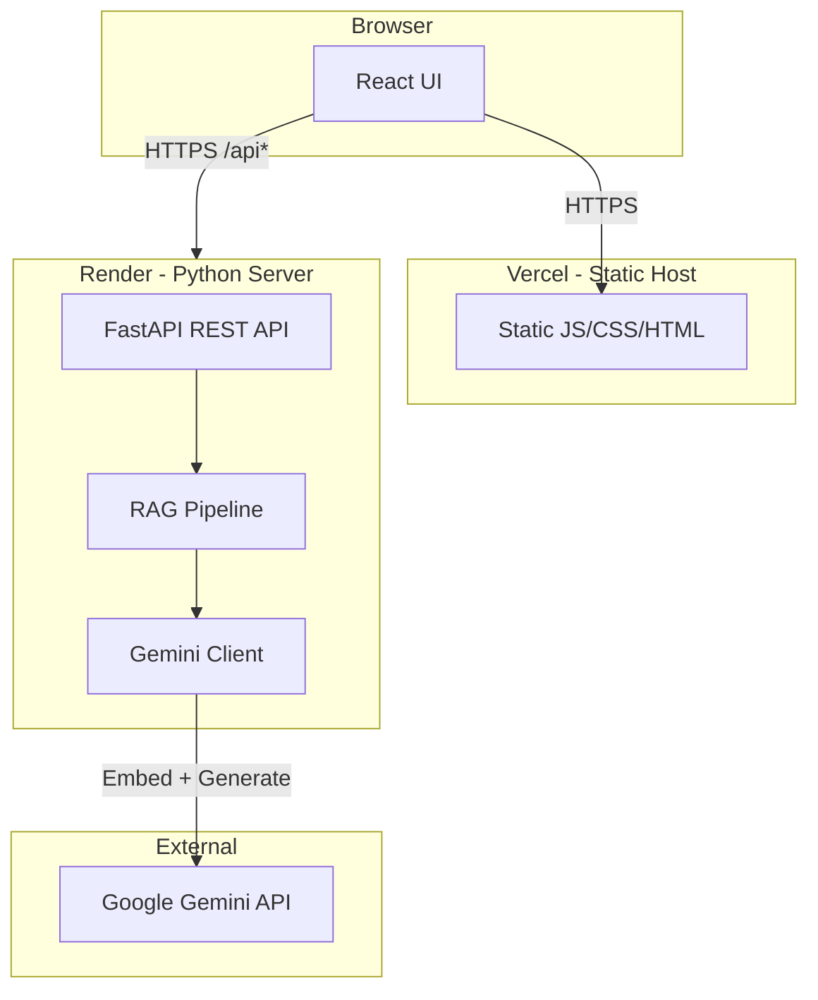

# Tech Career Fit Engine — Architecture Summary (for Data Scientists)

This document explains the system in terms you already know (APIs, data pipelines, embeddings, retrieval) and fills in the "full-stack" parts (frontend, backend, deployment) in plain language.

---

## 1. What the System Does (High Level)

The app is an **AI-powered resume analyzer** with **evidence grounding**:

- **Input:** Your resume (file or paste) + optional job description (JD).
- **Pipeline:** Parse → chunk → embed → index (RAG); then LLM uses retrieved chunks to analyze fit and generate tailored bullets.
- **Output:** Role fit scores, requirements vs. gaps, evidence chunks, and optionally a generated resume (all tied to retrieved text, not fabricated).

So in ML terms: **embeddings + retrieval (RAG) + structured generation**, exposed via a **web UI** and a **REST API**.

---

## 2. Overall Architecture (Three Layers)

- **Frontend:** The UI (React) is **static**: HTML, CSS, and JavaScript bundles. It runs entirely in the **browser**. It does not run Python or touch FAISS/Gemini directly; it only talks to the backend via **HTTP**.
- **Backend:** A single **Python process** (FastAPI app) that handles all "heavy" work: file parsing, chunking, embedding, FAISS indexing, and calling Gemini. It stores runtime data (FAISS indices, session metadata) on the server's disk under `backend/data/`.
- **External API:** All LLM and embedding calls go to **Google Gemini** (embed + generate). The backend is the only component that talks to Gemini.

So: **Browser ↔ Backend (Python) ↔ Gemini**. The frontend is "dumb" in a good way—it just displays data and sends user actions to the backend.

---

## 3. Technologies Used and Why

### 3.1 Frontend (what runs in the browser)

| Technology | Role | Why this and not the other |
|------------|------|----------------------------|
| **React** | UI components and state | Industry standard, huge ecosystem, easy to get help. Alternatives (Vue, Svelte) are fine too; React was a straightforward choice for a small team. |
| **TypeScript** | Typing for JavaScript | Catches many bugs at edit time and makes API contracts (request/response shapes) explicit—similar in spirit to type hints in Python. |
| **Vite** | Build tool and dev server | Fast dev feedback (HMR) and simple config. Replaces heavier setups like Create React App. "Build" = compile TS + bundle JS + output static files. |
| **No backend in frontend** | UI only | The frontend does not run Python, FAISS, or Gemini. It only calls the backend over HTTP. So "frontend" = client-side app only. |

**How the frontend talks to the backend:**

All requests go to a **base URL**. In development that's `/api`, and Vite **proxies** `/api` to `http://localhost:8000` (see [frontend/vite.config.ts](../frontend/vite.config.ts)). So the browser still sees `/api/health`, `/api/resume/upload/json`, etc., but the dev server forwards them to the Python server. In production, the base URL is set by `VITE_API_BASE` (e.g. the Render URL), so the same frontend code works with a remote backend.

---

### 3.2 Backend (Python server)

| Technology | Role | Why this and not the other |
|------------|------|----------------------------|
| **FastAPI** | REST API and request/response validation | Async support, automatic OpenAPI docs, and **Pydantic**-based validation (like type hints + runtime checks for every endpoint). Flask is simpler but no built-in schema validation; Django is heavier. FastAPI fits "API-only" services well. |
| **Uvicorn** | ASGI server | Runs the FastAPI app. "ASGI" is the async standard for Python web apps; Uvicorn is the common choice for FastAPI. |
| **Pydantic** (in [backend/models.py](../backend/models.py)) | Request/response schemas | Ensures every API body/query conforms to a schema (e.g. `session_id`, `target_role`). Invalid payloads are rejected before they reach business logic—similar to validating a DataFrame's columns before running a model. |
| **python-dotenv** | Load `.env` | Loads `GEMINI_API_KEY` and similar from a `.env` file so secrets are not hardcoded. |
| **Google GenAI SDK** (`google-genai`) | Call Gemini | Official SDK for Embedding and Generation APIs. All calls are centralized in [backend/gemini_client.py](../backend/gemini_client.py) so the rest of the app does not depend on Gemini directly. |

**Why REST over something else?**

REST over HTTP is universal: any client (browser, curl, Python script) can call the same endpoints. The frontend uses `fetch()` to send JSON and get JSON back. No need for WebSockets or GraphQL for this use case.

---

### 3.3 RAG and embeddings (backend only)

| Technology | Role | Why this and not the other |
|------------|------|----------------------------|
| **FAISS** (`faiss-cpu`) | Vector index for similarity search | Efficient approximate/exact nearest-neighbor search over embeddings. "IndexFlatIP" = exact inner product on **normalized** vectors ⇒ equivalent to cosine similarity. Kept in memory and on disk (`backend/data/`). Alternatives (e.g. Pinecone, Weaviate) are hosted services; FAISS keeps everything local and avoids extra cost/ops. |
| **Gemini Embedding API** | Turn text → vector | Same ecosystem as the generation model; embeddings are normalized so FAISS IndexFlatIP gives cosine similarity. |
| **Chunking** (in [backend/rag.py](../backend/rag.py)) | Split long text into fixed-size overlapping segments | Simple character-based sliding window (e.g. 800 chars, 120 overlap). No semantic splitter; keeps dependencies and logic minimal. Chunks are then embedded and stored in FAISS with metadata (e.g. chunk_id, source). |

**Dual indices:**

- **Global JD index:** `backend/data/jd.index` + `jd_meta.json` — job descriptions ingested via `/jd/ingest`.
- **Per-session resume index:** `backend/data/sessions/<session_id>/resume.index` + `resume_meta.json` — one index per uploaded resume.

Retrieval: embed the query (e.g. "What are the key requirements?"), search the right index (JD and/or resume), get top-k chunks, and pass them to the LLM as context. So "RAG" here = **retrieve chunks by embedding similarity, then generate with that context**.

---

### 3.4 LLM usage (backend only)

| Technology | Role | Why this and not the other |
|------------|------|----------------------------|
| **Gemini Generation API** (e.g. `gemini-2.0-flash`) | Structured outputs (fit analysis, cluster match, resume bullets) | One provider for both embed and generate; JSON schema in the request constrains the output so the backend can parse it reliably (no extra parsing layer). |
| **Prompts** (in [backend/prompts.py](../backend/prompts.py)) | System + user prompts and JSON schemas | All prompt text and response schemas live in one place. The LLM is instructed to use **only** the provided chunks (resume + JD) and to output JSON matching the schema—enforcing "evidence grounding." |

So: **Embedding API** for RAG; **Generation API** for analysis and resume generation. Both go through [backend/gemini_client.py](../backend/gemini_client.py); [backend/main.py](../backend/main.py) and [backend/rag.py](../backend/rag.py) never call the Gemini SDK directly.

---

### 3.5 File parsing (backend)

- **PDF:** PyMuPDF for text extraction; if the PDF is image-only, fallback to Tesseract (pytesseract + Pillow) for OCR.
- **DOCX:** python-docx.
- **TXT:** UTF-8 decode.

Parsing is in [backend/rag.py](../backend/rag.py); the REST layer in [backend/main.py](../backend/main.py) just receives the file and passes bytes to RAG.

---

### 3.6 Deployment

| Where | What | Why |
|-------|------|-----|
| **Vercel** | Frontend only (static build from `frontend/`) | Optimized for static/SPA: build = `npm run build`, output = `frontend/dist`. Root [vercel.json](../vercel.json) points install/build/output to `frontend/` so deployment from repo root works. SPA rewrite sends unknown paths to `index.html` so client-side routing works. |
| **Render** | Backend only (Python, one web service) | Free tier, no Docker required; "build" = `pip install -r requirements.txt`, "start" = `uvicorn main:app --host 0.0.0.0 --port $PORT`. Backend and frontend are independent: frontend's `VITE_API_BASE` is set to the Render URL so production traffic goes to that backend. |
| **CORS** (in [backend/main.py](../backend/main.py)) | `allow_origins=["*"]` | The browser blocks cross-origin requests unless the server sends the right headers. Backend allows the Vercel origin so the deployed frontend can call the deployed backend. |

So: **two separate deployments** (frontend on Vercel, backend on Render), connected only by the API base URL. No shared database or shared process.

---

## 4. How the Pieces Work Together (Data Flow)

### 4.1 Resume upload and processing

1. User uploads a file or pastes text in the UI (React).
2. Frontend calls `POST /resume/upload` or `POST /resume/upload/json` (see [frontend/src/api.ts](../frontend/src/api.ts)).
3. Backend returns `session_id` and `upload_id` immediately; processing runs **in the background** (thread pool in [backend/rag.py](../backend/rag.py)).
4. Pipeline: parse file → chunk text → embed chunks (Gemini) → build FAISS index → save to `data/sessions/<session_id>/`; also run extraction + clustering (Gemini) and save results.
5. Frontend **polls** `GET /resume/status?upload_id=...` until status is `ready` (or `error`).
6. Later requests (analyze, generate, cluster) use `session_id` so the backend can load that session's index and metadata.

So: **async job** (upload → background pipeline) + **polling** for status. No WebSockets; simple and sufficient.

### 4.2 Analyze fit / generate resume

1. User picks target role and JD source (curated vs custom text) in the UI.
2. Frontend calls `POST /analyze/fit` or `POST /resume/generate` with `session_id`, `target_role`, and optional `jd_text`.
3. Backend loads the session's resume index and, if needed, retrieves JD chunks (from global JD index or by embedding the pasted JD).
4. Backend builds a prompt that includes **retrieved chunks** (evidence) and calls Gemini with the appropriate schema (see [backend/prompts.py](../backend/prompts.py)).
5. Gemini returns JSON; backend maps it to Pydantic models and returns it to the frontend.
6. Frontend displays analysis or generated resume; evidence chunks are traceable to chunk IDs in the response.

So: **RAG (retrieve) → prompt (with chunks) → Gemini (generate) → validate and return**.

### 4.3 Frontend state and steps

- **State** is centralized in a single hook, [frontend/src/useCareerFit.ts](../frontend/src/useCareerFit.ts): session id, upload id, step (1/2/3 or cluster), stickers, analysis, errors, etc.
- **Steps:** 1 = Sticker Board (upload/paste resume), 2 = Target Role (choose role + JD), 3 = Analysis (fit + generate/export). "Clusters" is an alternate view (experience clustering).
- **API client** ([frontend/src/api.ts](../frontend/src/api.ts)) is a thin layer: `fetch(API_BASE + path, ...)` with JSON in/out. No Redux or global store; React state + `useCareerFit` is enough.

---

## 5. Summary Table (Recap)

| Layer | Main tech | Purpose |
|-------|-----------|--------|
| **UI** | React, TypeScript, Vite | Static app in the browser; calls backend over HTTP. |
| **API** | FastAPI, Uvicorn, Pydantic | REST API; validates input/output; runs RAG and LLM logic. |
| **RAG** | FAISS, Gemini Embed, chunking in rag.py | Vector index over resume and JD chunks; retrieval by cosine similarity. |
| **LLM** | Gemini Generate, prompts.py | Structured analysis and resume generation grounded in retrieved chunks. |
| **Deploy** | Vercel (frontend), Render (backend) | Separate hosts; frontend configured with backend URL. |

**Why this stack:**

- **Separation of concerns:** UI only renders and sends actions; all ML and data live in the backend.
- **Evidence grounding:** RAG + schema-constrained generation keep outputs tied to retrieved text.
- **Simplicity:** One backend language (Python), one LLM provider (Gemini), local FAISS, no extra DB for MVP.
- **Deployment:** Static frontend and single-process backend fit standard hosting (Vercel + Render) without containers or orchestration.

If you are used to notebooks or scripts: **frontend = the "dashboard" that calls an API; backend = the "script" that runs your RAG + model pipeline and exposes it as HTTP endpoints.**
