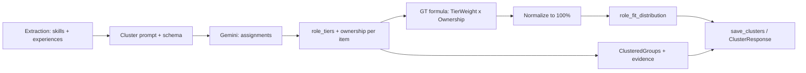

# GT Role Percentage Implementation Plan

## Goal

Compute `role_fit_distribution` using the **GT method** ([role_percentage_comp_method.md](../test_fixtures/resume_cross_functional_role/role_percentage_comp_method.md)):

- **Tier weights**: Tier-1 = 1.0, Tier-2 = 0.6, Tier-3 = 0.3 (per evidence–role pair).
- **Ownership multipliers**: primary 1.0, parallel 0.8, earlier_career 0.7, add_on 0.6, coursework 0.4.
- **Formula**: `WeightedScore(r) = sum_e [ TierWeight(e,r) * OwnershipMultiplier(e) ]`, then normalize to 100%.

Evidence units = extracted skills + experiences. Multi-role contribution allowed (same unit can add to MLE, SWE, DS, etc. with different tiers).

---

## Current vs Target

| Aspect | Current (equal-split) | Target (GT) |
|--------|------------------------|-------------|
| Per (item, role) | 1 / num_clusters | Tier weight (1.0 / 0.6 / 0.3) |
| Per item | — | Ownership multiplier (1.0–0.4) |
| Accumulation | Sum then normalize | Sum then normalize (same) |

ClusteredGroups and evidence chunks are unchanged; only how we compute `role_fit_distribution` changes.

---

## Implementation

### 1. Constants and tier/ownership mapping

**File:** [backend/rag.py](../backend/rag.py) (or a small `backend/gt_role_fit.py` module)

- `TIER_WEIGHT = {1: 1.0, 2: 0.6, 3: 0.3}`.
- `OWNERSHIP_MULT = {"primary": 1.0, "parallel": 0.8, "earlier_career": 0.7, "add_on": 0.6, "coursework": 0.4}`.
- Default ownership when missing: `"primary"` (1.0). Default tier when missing for a role: skip that (role, item) contribution.

### 2. Extend clustering schema and prompt

**File:** [backend/prompts.py](../backend/prompts.py)

- **CLUSTER_SYSTEM**: Add a short description of:
  - **Tiers**: Tier-1 = core responsibility (1.0), Tier-2 = strong adjacent (0.6), Tier-3 = weak/contextual (0.3). Use the MLE example from the GT doc (deployment vs PyTorch vs “used ML”).
  - **Ownership**: primary role / parallel / earlier career / add-on / coursework. One category per evidence unit.
- **CLUSTER_SCHEMA** – extend each assignment:
  - `role_tiers`: array of `{ "role": "MLE"|"DS"|"SWE"|"QR"|"QD", "tier": 1|2|3 }`. Multi-role allowed; each (role, tier) optional.
  - `ownership`: string, enum `["primary", "parallel", "earlier_career", "add_on", "coursework"]`, default `"primary"`.
- Keep `clusters` for backward compatibility and for building ClusteredGroups. Derive clusters from `role_tiers` (roles with tier 1, 2, or 3) when present; else keep using `clusters`.
- **build_cluster_prompt**: Unchanged structurally; optional one-line note that tier + ownership improve role-fit scoring.

### 3. Compute GT `role_fit_distribution` in `run_clustering`

**File:** [backend/rag.py](../backend/rag.py)

- After parsing `assignments`:
  - If **GT data present** (any assignment has non-empty `role_tiers`):
    - For each assignment `a`: `ownership_mult = OWNERSHIP_MULT.get(a.get("ownership"), 1.0)`.
    - For each `{role, tier}` in `a["role_tiers"]`: `tier_w = TIER_WEIGHT.get(tier)`. If `tier_w` is None, skip. Add `tier_w * ownership_mult` to `WeightedScore[role]`.
    - Normalize: `role_fit_distribution[r] = WeightedScore[r] / total` (total = sum over all roles), all five roles in output.
  - **Fallback**: If no `role_tiers` (or empty), keep current **equal-split** logic for `role_fit_distribution` so existing behavior and old `clusters.json` still work.
- Continue building `ClusteredGroup`s from either `role_tiers` (roles with any tier) or `clusters`. Keep existing evidence construction.

### 4. Optional: evidence_contributions artifact (GT §12)

- Add `evidence_contributions` per role, e.g. `{"MLE": [{"text": "...", "tier": 1, "weight": 1.0}, ...], ...}`.
- Store in `clusters.json` and optionally expose via API (e.g. `ClusterResponse` or a separate endpoint). Mark as optional; implement if time permits.

### 5. Backward compatibility and QA

- **Storage**: `role_fit_distribution` remains in `clusters.json`; same shape `dict[str, float]`. No migration.
- **qa_helpers**: `cluster_distribution_from_response` already uses `role_fit_distribution` when present. No change.
- **Fallback cluster** (stickers/paste): still no `role_fit_distribution`; unchanged.

### 6. Verification

- Run resume-only clustering: `python tests/test_resume_only_clustering.py -r test_fixtures/resume_cross_functional_role/Resume_1_MLE_Enriched.txt`. Percentages should follow the GT formula (tier + ownership); may align better with GT (e.g. MLE 55%, SWE 25%, DS 15%).
- Run batch QA Phase 1; confirm L1 vs `ground_truth_before` uses the new distribution.

### 7. Save plan to docs

- This document lives at **`docs/backend-gt-role-percentage-implementation-plan.md`**.
- Contents: (1) link to role_percentage_comp_method.md, (2) summary of tier/ownership and formula, (3) implementation steps above, (4) verification commands.

---

## Summary of edits

| File | Change |
|------|--------|
| [backend/prompts.py](../backend/prompts.py) | Extend CLUSTER_SYSTEM (tiers + ownership); extend CLUSTER_SCHEMA (`role_tiers`, `ownership`). |
| [backend/rag.py](../backend/rag.py) | Add TIER_WEIGHT / OWNERSHIP_MULT; GT accumulation + normalize in `run_clustering`; fallback to equal-split; derive clusters from `role_tiers` when present. |
| [docs/backend-gt-role-percentage-implementation-plan.md](backend-gt-role-percentage-implementation-plan.md) | This plan: GT method summary, implementation steps, verification. |

---

## Data flow (high level)

---

## Out of scope (for later)

- Hard constraints (GT §9): primary ≥1 Tier-1, no role >80%, etc. Not enforced in this phase.
- Section-aware extraction (EXPERIENCE vs EDUCATION) for ownership; LLM infers from context for now.
