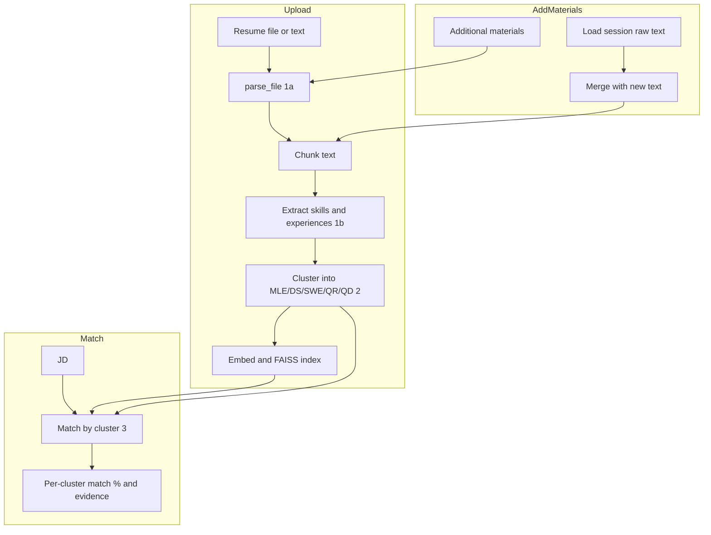

# Backend: Parse, Cluster, Match, and Add Materials

Design document for implementing (1) resume parsing with skills/experience extraction, (2) predefined-role clustering (MLE, DS, SWE, QR, QD) with evidence, (3) JD matching with per-cluster match percentage and evidence, and (4) additional-materials flow that merges into the resume and re-runs extraction and clustering.

---

## Current State vs Requirements

| Requirement | Current | Gap |
|-------------|---------|-----|
| **1a** Extract text from PDF | `rag.parse_file` (backend/rag.py) supports PDF/DOCX/TXT + OCR | None; keep as-is |
| **1b** Parse text → extract skills, experiences | Only chunking; no structured extraction | Add LLM-based extraction |
| **2** Cluster into MLE/DS/SWE/QR/QD with evidence | `/experience/cluster` placeholder (single cluster) | Implement role-based classification + evidence |
| **3** Match resume to JD, % per cluster + evidence | `/analyze/fit` returns single role fit, requirements, gap | Add per-cluster match % and evidence |
| **4** Additional materials → parse, cluster, enhance | No "add materials" flow | New endpoint; merge, re-extract, re-cluster |

---

## Architecture Overview



- **1a** stays in `rag.parse_file`. **1b**, **2**, and **3** use Gemini (structured output) plus existing RAG chunks for grounding.
- **4**: Persist raw resume text per session; "add materials" merges new parsed text, then re-runs chunking → extraction → clustering → re-index.

---

## 1. Parsing and Extraction (1a + 1b)

### 1a – Keep existing

- Continue using `rag.parse_file` for PDF/DOCX/TXT. No code changes.

### 1b – Extract skills and experiences

- **Where:** New module `backend/extraction.py` (or add to `rag.py`). Call from `process_resume_background` **after** chunking.
- **Flow:**
  1. Chunk resume text as today (reuse `chunk_text`).
  2. Call Gemini with a **structured schema**: input = resume chunks (with IDs); output = `{ skills: [{ name, chunk_ids[] }], experiences: [{ text, chunk_ids[] }] }`.
  3. Enforce grounding: each skill/experience must cite `chunk_id`s from the provided chunks.
- **Prompts:** Add `EXTRACT_SYSTEM`, `EXTRACT_SCHEMA` in `prompts.py`, and a `build_extract_prompt(chunks)` helper.
- **Storage:** Persist extraction per session. New file `data/sessions/{session_id}/extraction.json`:
  ```json
  { "skills": [...], "experiences": [...], "chunk_ids_used": [...] }
  ```
- **Models:** New Pydantic models in `models.py`, e.g. `ExtractedSkill`, `ExtractedExperience`, `ExtractionResult`.

---

## 2. Clustering into MLE / DS / SWE / QR / QD (2)

- **Cluster set:** MLE, DS, SWE, QR, QD. Add `ClusterType` enum in `models.py` (use for clustering only; keep `RoleType` for JD/target-role if needed).
- **Logic:** Classification, not unsupervised clustering. For each extracted skill and experience, assign **one or more** cluster labels (MLE/DS/SWE/QR/QD) via Gemini. Group results by cluster.
- **Evidence:** For each cluster, evidence = list of (skill/experience snippet + supporting `chunk_id`s). Reuse or extend `EvidenceChunk`-style structure.
- **Where:**
  - New function `cluster_extraction(extraction, chunks_meta) -> list[ClusteredGroup]` in a dedicated module (e.g. `backend/clustering.py`) or inside `rag.py`.
  - Prompts: `CLUSTER_SYSTEM`, `CLUSTER_SCHEMA` in `prompts.py`.
- **Storage:** `data/sessions/{session_id}/clusters.json`:
  ```json
  {
    "clusters": [
      { "cluster_id": "MLE", "cluster_label": "Machine Learning Engineer", "items": [...], "evidence": [...] }
    ]
  }
  ```
- **API:** Replace the placeholder implementation of `POST /experience/cluster`.
  - **Input:** `session_id` (and optionally `items` + `resume_text` for sticker/paste flow; see “Backward compatibility” below).
  - **Output:** `ClusterResponse` with `clusters` = list of `ClusteredGroup` for MLE/DS/SWE/QR/QD, each with `items` and `evidence`.
- **Update** `ClusterRequest` / `ClusterResponse` and `ClusteredGroup` so that `cluster_id` / `cluster_label` align with `ClusterType`, and each group includes evidence (e.g. list of `EvidenceChunk` or similar).

---

## 3. Match Resume to JD, Per-Cluster % and Evidence (3)

- **Goal:** For each cluster present in the resume, output match percentage vs JD and supporting evidence.
- **Inputs:** `session_id`, JD (curated or pasted `jd_text`), same as current analyze flow.
- **Logic:**
  1. Load session clusters and extraction (from `clusters.json` / `extraction.json`).
  2. Load JD chunks (curated index or `search_temp_jd` for pasted JD).
  3. For each cluster, run a **match step**: Gemini (or similarity over chunk pairs) to compute match % and cite resume + JD evidence. All claims must be grounded in chunks.
- **Output:** e.g. `MatchByClusterResponse`:
  ```text
  {
    "cluster_matches": [
      { "cluster": "MLE", "match_pct": 0.85, "evidence": { "resume_chunks": [...], "jd_chunks": [...] } },
      ...
    ],
    "overall_match_pct": 0.72
  }
  ```
- **API:** New endpoint `POST /analyze/match-by-cluster` to avoid breaking existing `/analyze/fit` and frontend. Reuse existing JD retrieval (curated vs pasted).
- **Models:** `MatchByClusterRequest` (reuse `session_id` + JD source), `ClusterMatch`, `MatchByClusterResponse` in `models.py`.
- **Prompts:** New `MATCH_BY_CLUSTER_SYSTEM` and schema in `prompts.py`; `gemini_client.generate` with JSON schema.

---

## 4. Additional Materials (4)

- **Behavior:** Parse like resume (1a), extract (1b), cluster (2). **Merge** new content into the resume and **re-run** the full pipeline (chunk → extract → cluster → embed → index).
- **Precondition:** Session must already have a processed resume (we need stored raw text to merge).
- **Storage change:** Persist raw resume text at first upload. Add `data/sessions/{session_id}/resume_raw.txt` in `process_resume_background` before chunking.
- **New endpoint:** `POST /resume/materials/add`
  - **Input:** `session_id` (required), plus either `file` (multipart) or `text` (form/JSON), same as resume upload.
  - **Flow:**
    1. Load `resume_raw.txt` for `session_id`.
    2. Parse new content (if file → `parse_file`; if text → use as-is).
    3. Merge: `merged = stored_raw + "\n\n" + new_text`.
    4. Overwrite `resume_raw.txt` with `merged`.
    5. Re-run pipeline: chunk → embed → update FAISS index and `resume_meta.json`; then extract → save `extraction.json`; then cluster → save `clusters.json`.
  - **Output:** Same as resume upload, e.g. `{ session_id, upload_id }`, and reuse status polling (`/resume/status`) for async processing.
- **Concurrency:** Ensure only one processing job per `session_id` at a time (e.g. queue or lock in `process_resume_background` / add-materials flow).

---

## 5. Pipeline Integration

- **`process_resume_background`** (rag.py):
  1. Save raw text to `resume_raw.txt`.
  2. Chunk → embed → build FAISS index, write `resume_meta.json` (as today).
  3. Call extraction (1b) → write `extraction.json`.
  4. Call clustering (2) → write `clusters.json`.
- **Add-materials:** Re-use the same pipeline (or a shared subroutine) with merged text; ensure FAISS index and metadata are **replaced** for that session (not appended inconsistently).

---

## 6. Models and Schemas

- **New enums:** `ClusterType`: MLE, DS, SWE, QR, QD.
- **New models:** `ExtractedSkill`, `ExtractedExperience`, `ExtractionResult`; extend or add `ClusteredGroup` with evidence; `ClusterMatch`, `MatchByClusterRequest`, `MatchByClusterResponse`.
- **Existing:** Keep `RoleType`, `EvidenceChunk`, `Evidence`; reuse where applicable for evidence in clustering and match-by-cluster.

---

## 7. Backward Compatibility

- **`POST /analyze/fit`:** Leave unchanged. Frontend can keep using it for “role fit” and JD requirements/gap.
- **`POST /experience/cluster`:**
  - **Primary:** When `session_id` is present and we have `extraction.json` + `clusters.json`, return role-based clusters (MLE/DS/SWE/QR/QD) with evidence.
  - **Fallback:** If no extraction (e.g. old session or stickers-only), keep current behavior: use `items` + `resume_text` + optional resume chunks, and return a single “All Experiences” cluster (or minimal clusters) so existing frontend still works.

---

## 8. File and Dependency Summary

| File | Changes |
|------|---------|
| `backend/rag.py` | Persist `resume_raw.txt`; run extraction + clustering after index build; optional `merge_and_reprocess(session_id, new_text)` for add-materials |
| `backend/prompts.py` | Add extract / cluster / match-by-cluster prompts and JSON schemas |
| `backend/models.py` | Add `ClusterType`, extraction models, cluster models with evidence, match-by-cluster request/response |
| `backend/main.py` | `POST /resume/materials/add`; `POST /analyze/match-by-cluster`; update `POST /experience/cluster` |
| `backend/gemini_client.py` | No change; reuse `generate` with new schemas |
| **New** `backend/extraction.py` or **New** `backend/clustering.py` | Optional; otherwise add in `rag.py` |

---

## 9. Frontend Hooks (Reference Only)

- **Add materials:** New API helper, e.g. `addMaterials(sessionId, file | text)`, plus UI to upload/paste and optionally poll status.
- **Match by cluster:** New helper `matchByCluster(sessionId, jdSource, jdText?)` and a view to show per-cluster match % and evidence.
- **Clusters:** Existing `clusterExperience` and `ClusterView` can be wired to the updated `POST /experience/cluster` response (MLE/DS/SWE/QR/QD + evidence). Frontend changes are out of scope for this backend-only plan.

---

## 10. Testing

- **Unit:** Extraction schema output parsing; clustering output parsing; merge logic for add-materials.
- **Integration:** Upload resume → check `extraction.json` and `clusters.json`; add materials → verify merged raw text and updated extraction/clusters/index; match-by-cluster → verify structure and evidence.
- **Curl:** Examples for `POST /resume/materials/add` and `POST /analyze/match-by-cluster` (and updated `POST /experience/cluster`) in README or internal doc.

---

## 11. Open Decisions

1. **Match % method:** Prefer Gemini-based assessment grounded on chunks, or semantic similarity (e.g. chunk-level matching) then aggregate? Plan assumes Gemini-first; similarity can be a fallback or alternative.
2. **QR/QD in JD ingest:** Curated JDs use `RoleType` (today DS/MLE/SWE/OTHER). If we add QR/QD clusters, consider extending JD role enums or adding a separate tag for “cluster” vs “JD role” to avoid confusion.
3. **Stickers / pasted text in cluster:** Current cluster endpoint accepts stickers + pasted text. We can keep that as fallback when no resume extraction exists; when extraction exists, we use MLE/DS/SWE/QR/QD clusters. Exact fallback behavior can be refined during implementation.
