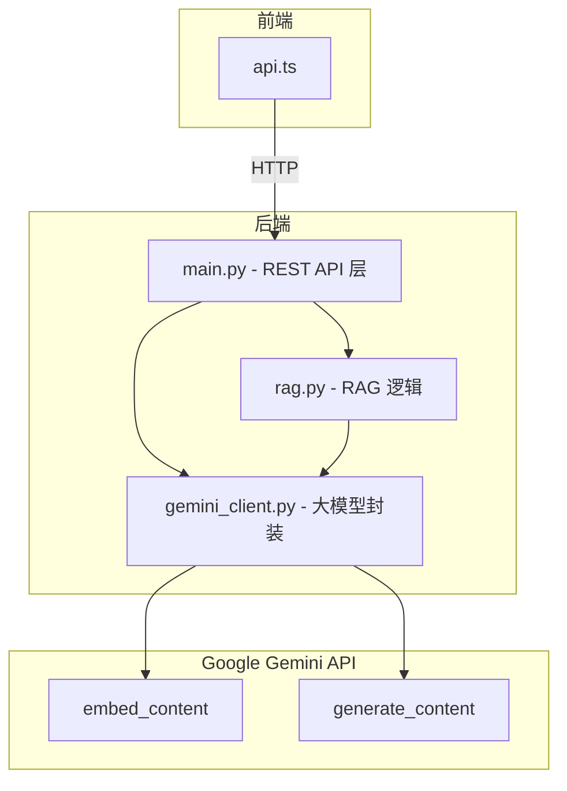

# Tech Career Fit Engine - 大模型 API 调用说明

本文档说明本产品在工程上如何拆分并调用大模型 API，以及后端 REST API 的封装方式。

---

## 一、产品简介

**Tech Career Fit Engine** 是一款 AI 驱动的简历与岗位匹配分析工具，主要功能包括：

- **简历解析与结构化**：解析 PDF/DOCX/TXT 简历，抽取经历、技能、教育背景
- **经历聚类**：将简历内容聚类到 MLE/DS/SWE/QR/QD 等科技角色
- **岗位匹配分析**：基于 RAG 检索，分析简历与 JD 的匹配度、需求、差距
- **按簇匹配**：按角色簇展示与 JD 的匹配百分比及证据
- **简历生成**：根据目标岗位生成定制化简历（严格基于证据，不虚构）

产品采用 **Google Gemini API** 实现上述 AI 能力，后端使用 **FastAPI** 封装为 REST API，供前端调用。

---

## 二、大模型 API 列表

本产品调用 **Google Gemini** 的两类 API：

| API 类型 | SDK 方法 | 默认模型 | 用途 |
|----------|----------|----------|------|
| **Embedding API** | `client.models.embed_content` | `gemini-embedding-001` | 文本向量化，用于 RAG 检索 |
| **Generation API** | `client.models.generate_content` | `gemini-2.0-flash` | 文本生成（JSON 结构化输出） |

### 1. Embedding API

- **作用**：将文本转换为向量，用于 FAISS 语义检索
- **调用方式**：`embed_content(model, contents=batch)`
- **输出**：归一化向量，供 FAISS IndexFlatIP 做余弦相似度检索

### 2. Generation API

- **作用**：根据 prompt 生成结构化 JSON（技能抽取、聚类、匹配分析、简历生成等）
- **调用方式**：`generate_content(model, contents=prompt, config=GenerateContentConfig)`
- **输出**：按 `response_schema` 约束的 JSON 对象

---

## 三、API 封装与拆分

所有大模型 API 调用均集中在独立模块 **`backend/gemini_client.py`**，实现与业务逻辑的解耦。

### 调用架构



### gemini_client.py 接口

| 函数 | 底层 API | 说明 |
|------|----------|------|
| `embed_texts(texts: list[str])` | `embed_content` | 批量文本向量化，返回归一化向量列表 |
| `embed_single(text: str)` | `embed_content` | 单条文本向量化 |
| `generate(system_prompt, user_prompt, json_schema)` | `generate_content` | 生成内容，支持 JSON schema 约束输出 |

仅 `gemini_client.py` 直接与 `google.genai` SDK 交互，`main.py` 和 `rag.py` 均通过该模块间接调用大模型。

---

## 四、调用场景一览

### Embedding API 调用

| 场景 | 代码位置 | 说明 |
|------|----------|------|
| JD 入库索引 | `rag.py` - `ingest_jds()` | JD 文本分块后向量化，写入全局 FAISS 索引 |
| JD 检索 | `rag.py` - `search_jd_index()` | 查询向量化，在 JD 索引中检索 top-k |
| 简历入库索引 | `rag.py` - `_run_full_pipeline()` | 简历分块后向量化，写入会话级 FAISS 索引 |
| 简历检索 | `rag.py` - `search_resume_index()` | 查询向量化，在简历索引中检索 top-k |
| 临时 JD 检索 | `rag.py` - `search_temp_jd()` | 用户粘贴 JD 时，临时向量化并检索 |

### Generation API 调用

| 场景 | 代码位置 | 对应 REST 端点 |
|------|----------|----------------|
| 简历结构化抽取 | `rag.py` - `extract_resume_structure()` | `/resume/upload` 后台流程 |
| 技能/经历抽取 | `rag.py` - `run_extraction()` | `/resume/upload` 后台流程 |
| 角色聚类 | `rag.py` - `run_clustering()` | `/resume/upload` 后台流程 |
| 岗位匹配分析 | `main.py` - `analyze_fit()` | `POST /analyze/fit` |
| 按簇匹配分析 | `main.py` - `analyze_match_by_cluster()` | `POST /analyze/match-by-cluster` |
| 简历生成 | `main.py` - `generate_resume_internal()` | `POST /resume/generate`、`POST /resume/export_docx` |

---

## 五、环境配置

### 必需环境变量

| 变量 | 说明 |
|------|------|
| `GEMINI_API_KEY` | Google AI API 密钥，从 [Google AI Studio](https://aistudio.google.com/apikey) 获取 |

### 可选环境变量

| 变量 | 默认值 | 说明 |
|------|--------|------|
| `GEMINI_EMBED_MODEL` | `gemini-embedding-001` | Embedding 模型名 |
| `GEMINI_GEN_MODEL` | `gemini-2.0-flash` | 生成模型名 |

配置方式：复制 `backend/env.template` 为 `backend/.env`，填入 `GEMINI_API_KEY`，并按需覆盖模型名。

---

## 六、REST API 端点

后端以 FastAPI 提供 REST API，供前端 `frontend/src/api.ts` 调用。主要端点：

| 方法 | 路径 | 功能 |
|------|------|------|
| GET | `/health` | 健康检查 |
| POST | `/jd/ingest` | 入库 JD |
| POST | `/resume/upload` | 上传简历（文件） |
| POST | `/resume/upload/json` | 上传简历（JSON 文本） |
| GET | `/resume/status` | 查询处理状态 |
| GET | `/resume/structured` | 获取结构化简历 |
| POST | `/resume/materials/add` | 追加材料 |
| POST | `/analyze/fit` | 岗位匹配分析（调用 Gemini Generation） |
| POST | `/analyze/match-by-cluster` | 按簇匹配分析（调用 Gemini Generation） |
| POST | `/resume/generate` | 生成定制简历（调用 Gemini Generation） |
| POST | `/resume/export_docx` | 导出 Word |
| POST | `/experience/cluster` | 获取经历聚类 |

---

## 七、截图与验证建议

为证明 API 调用和后端 REST API 正常工作，建议准备以下截图：

### 方式一：自动验证脚本（推荐）

在项目根目录执行（需先启动后端）：

```bash
./tests/verify_api_for_screenshots.sh
```

脚本会依次执行健康检查、上传简历、`/analyze/fit`、`/resume/generate`，并格式化输出 JSON。对终端输出分步截图即可。

### 方式二：手动执行

1. **后端启动 + 健康检查**
   ```bash
   cd backend && uvicorn main:app --port 8000
   ```
   另开终端：
   ```bash
   curl http://localhost:8000/health
   ```
   返回 `{"status":"ok","message":"Tech Career Fit Engine is running"}`

2. **AI 功能验证**（需先上传简历并等待 `status=ready`）
   ```bash
   # 上传简历
   curl -X POST http://localhost:8000/resume/upload/json \
     -H "Content-Type: application/json" \
     -d '{"text":"John Doe, Software Engineer. 5 years Python, AWS, ML. Skills: Python, TensorFlow, SQL."}'
   # 得到 session_id、upload_id 后轮询状态，直至 ready

   # 岗位匹配分析
   curl -X POST http://localhost:8000/analyze/fit \
     -H "Content-Type: application/json" \
     -d '{"session_id":"<SESSION_ID>","target_role":"MLE","use_curated_jd":false,"jd_text":"ML Engineer: Python, PyTorch, MLOps."}'

   # 简历生成
   curl -X POST http://localhost:8000/resume/generate \
     -H "Content-Type: application/json" \
     -d '{"session_id":"<SESSION_ID>","target_role":"MLE","use_curated_jd":false,"jd_text":"ML Engineer: Python, PyTorch."}'
   ```
   返回 JSON 应包含 `recommended_roles`、`gap`、`resume_markdown` 等字段。

3. **端到端**：前端页面完成「上传简历 → 选择角色 → 查看分析结果」流程

---

## 八、GitHub 与部署

- **GitHub**：提交作业时提供项目仓库链接
- **部署**：前端部署于 Vercel，后端部署于 Render，详见 [deployment_log.md](deployment_log.md)


