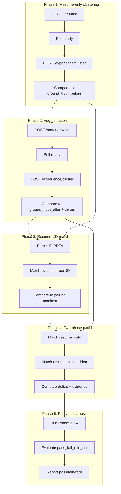

# QA Testing Plan from test_fixtures

## 1. Fixture Layout and Mapping

| Folder | Contents | Use |
|--------|----------|-----|
| [quant_cross_functional_role_fit_benchmark/](quant_cross_functional_role_fit_benchmark/) | 5 resumes (R1–R5), `Evaluation_Rubric_Role_Fit.txt` | Resume-only and augmentation inputs; role-fit rubric |
| [additional_materials_complement_resumes/](additional_materials_complement_resumes/) | 5 add-ons (1 per resume) | Augmentation; evidence provenance checks |
| [senior_us_mixed_jds_pdf_bundle/](senior_us_mixed_jds_pdf_bundle/) | 10 JD PDFs, `jd_index.json` | Resume–JD match tests; JD metadata |
| [qa_manifest_mapping/](qa_manifest_mapping/) | `qa_manifest.json` | Ground truth before/after, deltas, evidence themes, assertions, thresholds |
| [qa_manifest_resume_jd_pairings/](qa_manifest_resume_jd_pairings/) | `qa_manifest_resume_jd_pairings.json` | Resume–JD pairings (resume-only), expected overall + per-cluster match |
| [qa_manifest_resume_jd_pairings_two_phase/](qa_manifest_resume_jd_pairings_two_phase/) | `qa_manifest_resume_jd_pairings_two_phase.json` | Two-phase (resume_only vs resume_plus_addon) pairings and deltas |
| [qa_manifest_resume_jd_pairings_two_phase_passfail/](qa_manifest_resume_jd_pairings_two_phase_passfail/) | `qa_manifest_resume_jd_pairings_two_phase.json` + `pass_fail_rule_set` | Pass/fail rules (global, phase, case-level) for automated harness |

**Path resolution:** All manifest references (e.g. `resume_file`, `addon_file`, `jd_pdf`) resolve under `test_fixtures/` using the folder layout above (resumes in benchmark, addons in `additional_materials_complement_resumes/`, JDs in `senior_us_mixed_jds_pdf_bundle/`).

---

## 2. Test Phases

### Phase 1: Resume-only clustering (PRD 1–2)

**Goal:** Validate parse → extract → cluster (MLE/DS/SWE/QR/QD) with evidence.

**Steps per case (qa_manifest_mapping.test_cases):**

1. Upload resume: `POST /resume/upload/json` with `text` from `quant_cross_functional_role_fit_benchmark/<resume_file>`.
2. Poll `GET /resume/status?upload_id=...` until `ready`.
3. Call `POST /experience/cluster` with `session_id` only (or `session_id` + empty `items`).
4. **Assert:**
   - Response has `clusters` (MLE/DS/SWE/QR/QD) and `evidence` per cluster.
   - Derive a **cluster distribution** from API output (e.g. normalize counts or scores per cluster) and compare to `ground_truth_before` using L1 error.
   - Apply `global_thresholds.distribution_metrics` (`max_L1_error_primary_cluster`, `max_L1_error_overall`).
   - `global_thresholds.evidence`: min items per predicted cluster, optional verbatim/source checks (once backend supports addon attribution).

**Ground truth:** `qa_manifest_mapping/qa_manifest.json` → `test_cases[].ground_truth_before` and `global_thresholds`.

---

### Phase 2: Augmentation with additional materials (PRD 4)

**Goal:** Add materials → re-run pipeline → check cluster deltas and new evidence.

**Steps per case:**

1. Use same `session_id` from Phase 1.
2. Add materials: `POST /resume/materials/add/json` with `session_id` and `text` from `additional_materials_complement_resumes/<addon_file>`.
3. Poll `GET /resume/status?upload_id=...` until `ready`.
4. Call `POST /experience/cluster` again for that `session_id`.
5. **Assert:**
   - Cluster distribution moves toward `ground_truth_after_target`; directional changes match `expected_delta.directional` (+, -, ~).
   - `min_increase` / `max_increase_other` from `expected_delta` are satisfied.
   - `augmentation.expected_delta_min`, `max_unexpected_delta` from `global_thresholds.augmentation`.
   - Optional: `expected_new_evidence` themes appear in cluster evidence (e.g. "feature store", "MLflow") — string/substring checks.
   - `resume_level_assertions` and `qa_assertions` from the manifest (e.g. "MLE remains top-1", "≥2 MLE evidence items from addon") — enforce where backend supports addon attribution.

**Note:** Today, evidence is not tagged by "resume" vs "addon". Full assertion compliance may require backend changes (e.g. chunk source tracking when merging addons).

---

### Phase 3: Resume–JD match, resume-only (PRD 3)

**Goal:** For each resume, match against 2–3 expected best-fit JDs and check overall + per-cluster match.

**Prerequisites:**

- **JD input:** JDs are PDFs. Either (a) parse each PDF to text and call `POST /analyze/match-by-cluster` with `jd_text`, or (b) ingest JD text via `POST /jd/ingest` (with role/level from `jd_index.json`) and use `use_curated_jd` + a matching strategy. Manifests suggest pasted JD text; ingest is an alternative if we align roles (e.g. JD role → cluster).
- Use `jd_index.json` for JD metadata and `cluster_demand` (reference only; actual match targets come from pairing manifest).

**Steps per case (qa_manifest_resume_jd_pairings.cases):**

1. Reuse `session_id` from Phase 1 (resume-only, no addon).
2. For each `expected_best_fit_jds[]` entry:
   - Obtain JD text (e.g. from parsed `jd_pdf` in `senior_us_mixed_jds_pdf_bundle/`).
   - `POST /analyze/match-by-cluster` with `session_id`, `use_curated_jd: false`, `jd_text: <parsed JD>`.
3. **Assert:**
   - `overall_match_pct` within `tolerances.overall_match_abs_error` of `expected_overall_match`.
   - For each cluster in `expected_cluster_matches`, predicted `match_pct` within `tolerances.per_cluster_match_abs_error` (handle `null` as "cluster not relevant").
   - Evidence present for cited clusters.

**Ground truth:** [qa_manifest_resume_jd_pairings.json](qa_manifest_resume_jd_pairings/qa_manifest_resume_jd_pairings.json) `cases[].expected_best_fit_jds[]`.

---

### Phase 4: Two-phase resume–JD match (resume_only vs resume_plus_addon)

**Goal:** Same pairings as Phase 3, but for both resume-only and resume+addon; check score deltas and evidence.

**Steps per case (two_phase manifest):**

1. **Resume-only:** Match each JD as in Phase 3; record `overall_match` and `cluster_matches`.
2. **Resume+addon:** Use `session_id` after Phase 2 (addon merged). Match same JDs again.
3. **Assert:**
   - `resume_only` scores align with `expected_best_fit_jds_two_phase[].resume_only` (overall + per-cluster) within tolerances.
   - `resume_plus_addon` scores align with `resume_plus_addon` expectations.
   - Delta `overall_match` matches `expected_delta.direction` (+, -, ~) and magnitude within `delta_overall_match_abs_error`.
   - For JDs with positive expected delta: `evidence_requirements` (min items, expected_new_evidence_themes). Addon attribution required when we support it.

**Ground truth:** [qa_manifest_resume_jd_pairings_two_phase](qa_manifest_resume_jd_pairings_two_phase/), [two_phase_passfail](qa_manifest_resume_jd_pairings_two_phase_passfail/) manifests.

---

### Phase 5: Pass/fail rule harness

**Goal:** Run automated pass/fail using `pass_fail_rule_set` and case overrides.

**Rule sources:** [qa_manifest_resume_jd_pairings_two_phase_passfail](qa_manifest_resume_jd_pairings_two_phase_passfail/qa_manifest_resume_jd_pairings_two_phase.json) → `pass_fail_rule_set` and `pass_fail_rule_set_overrides` per case.

**Global rules (examples):**

- **PF-G1-SCHEMA:** All API responses conform to schemas (cluster, match-by-cluster, etc.).
- **PF-G2-EVIDENCE-COUNT:** For each cluster with score ≥ threshold, ≥ 2 evidence items.
- **PF-G3-EVIDENCE-VERBATIM:** Evidence = verbatim spans + source attribution (resume vs addon).
- **PF-G4-JD-RANKING-STABILITY:** Top-1 JD per phase matches manifest `expected_top1`.

**Phase rules:**

- **resume_only:** Overall and primary-cluster score within tolerances (e.g. PF-P1, PF-P2).
- **resume_plus_addon:** Delta direction (PF-A1), delta magnitude (PF-A2), addon evidence presence (PF-A3).

**Case overrides:** `expected_top1` (resume_only / resume_plus_addon), `positive_delta_jds`, and case-specific rules (e.g. PF-C1-TOP1-MUST-MATCH, PF-C2-POSITIVE-DELTA-REQUIRES-ADDON-EVIDENCE).

**Harness:** For each case, run Phase 2 + Phase 4, then evaluate global → phase → case rules; output pass/fail/warn per rule and overall.

---

### Phase 6: Role-fit rubric (manual or LLM-as-judge)

**Goal:** Use [Evaluation_Rubric_Role_Fit.txt](quant_cross_functional_role_fit_benchmark/Evaluation_Rubric_Role_Fit.txt) for qualitative scoring.

**Dimensions (0–5):** Primary role accuracy, secondary role ranking, evidence alignment, cross-functional sensitivity, career context awareness.

**Process:** For a subset of runs (e.g. resume-only and resume+addon cluster outputs, plus match-by-cluster results), either (a) human scoring or (b) LLM-as-judge with rubric + model outputs. Aggregate dimension scores and overall average. Useful for calibration and cross-functional / career-switcher cases (e.g. R5).

---

## 3. Implementation Artifacts

- **Test runner:** Script or pytest suite under `scripts/` or `tests/` that:
  - Loads `qa_manifest_mapping`, `qa_manifest_resume_jd_pairings`, and two-phase (pass/fail) manifests.
  - Resolves paths to `test_fixtures/` subdirs.
  - Calls backend (upload, status poll, cluster, add-materials, match-by-cluster) per phase.
  - Computes L1, deltas, and rule outcomes; writes a **QA report** (e.g. JSON + markdown summary).
- **JD handling:** Helper to parse JD PDFs (reuse `rag.parse_file` or equivalent) and optionally build `jd_index`-style metadata for ingest or jd_text lookup.
- **Cluster distribution:** Helper to map `/experience/cluster` response (cluster labels + items/evidence) to a normalized distribution (e.g. by item count or evidence weight) for comparison to `ground_truth_before` / `ground_truth_after_target`.

---

## 4. Backend Considerations

- **Evidence source attribution:** Manifests expect "resume" vs "addon" provenance. Current add-materials flow merges text; we do not tag chunk source. Adding source tags (e.g. in `resume_meta` or extraction) would allow strict provenance and PF-G3 / PF-A3 / addon assertions.
- **Match-by-cluster vs manifest metrics:** Our `match_pct` and `overall_match_pct` may differ from manifest `scoring_model` (e.g. L1-based). Use tolerances for comparison; document any mapping or calibration.
- **Curated JD vs pasted JD:** Pairing tests use specific JD files. Using `jd_text` from parsed PDFs is the most direct mapping. If using `/jd/ingest`, align role/level with `jd_index` and ensure we can select the same JDs for each pairing.

---

## 5. Execution Order and Dependencies

- Phase 1 must complete before Phase 2 (addon) and Phase 3 (match).
- Phase 2 must complete before Phase 4 resume_plus_addon and before Phase 5.
- Phase 5 uses the same flows as Phase 2 + 4, plus rule evaluation.

---

## 6. Deliverables

| Deliverable | Description |
|-------------|-------------|
| **Testing plan doc** | This plan, stored in `test_fixtures/qa-testing-plan.md`. |
| **Test runner** | Script or pytest that runs Phases 1–5, resolves paths from manifests, calls backend, evaluates rules, and produces a report. |
| **QA report** | JSON + human-readable summary (pass/fail/warn per rule, L1/delta metrics, and any rubric scores if Phase 6 is included). |
| **Path resolution** | Clear mapping from manifest `resume_file` / `addon_file` / `jd_pdf` to `test_fixtures/` paths. |

---

## 7. Open Decisions

1. **Runner language:** Python (pytest + requests) vs shell script vs both (shell orchestrating pytest). Python fits manifest parsing and numeric checks.
2. **JD input:** Prefer `jd_text` from parsed PDFs for pairings, or invest in ingest + curated indexing and align with `jd_index` roles.
3. **Addon attribution:** Scope and implementation for tagging chunk source (resume vs addon) to fully support evidence provenance assertions.
